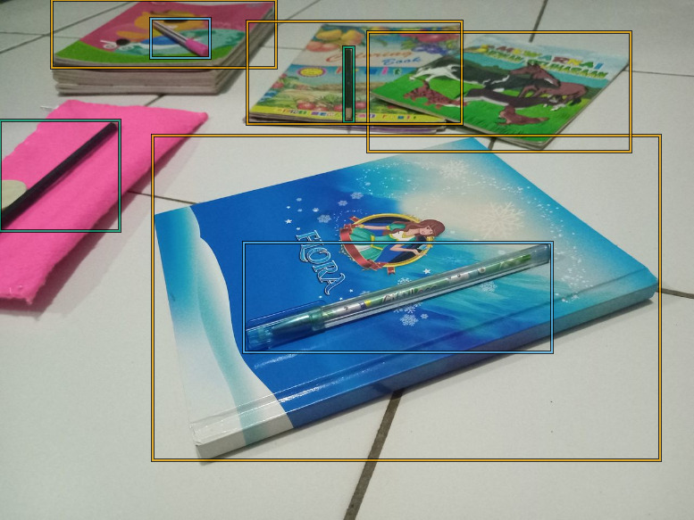
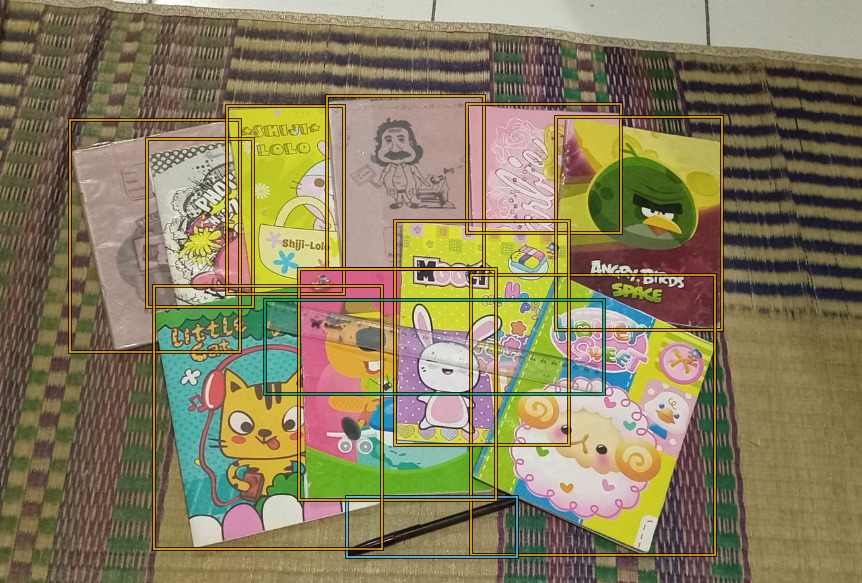

# image-annotation-project
Independent project: Object detection annotation using bounding boxes

## About This Project
Manual annotation of self-created dataset with bounding boxes for object detection. Images contain everyday items (books, pens, pencils, rulers) captured in various arrangements and lighting conditions.

**Skills demonstrated:**
- Object detection and bounding box annotation
- Attention to detail and annotation consistency
- Dataset organization and documentation
- Image annotation tool proficiency

**Tools used:** VGG Image Annotator

## Project Details
- Source: 50 self-created images
- Objects annotated: book, pen, pencil, ruler
- Annotation format: VIA JSON (VGG Image Annotator)
- Total annotations: 189

## Project Structure
- raw_images/ - Original dataset (50 images in JPG format)
- annotations/ - Annotated data in VIA JSON format
- samples/ - Sample annotated images for portfolio demonstration
- ANNOTATION_GUIDELINES.md - Detailed annotation rules and standards

## Sample Results
### Sample 1

### Sample 2

### Sample 3

